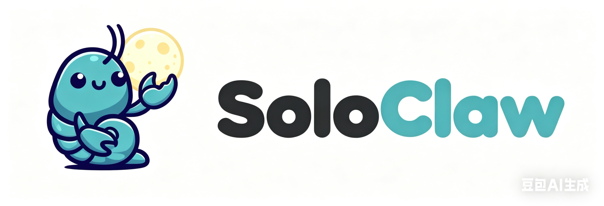

<p align="center">
  
</p>

<p align="center">
  A personal Telegram AI agent built with Claude Agent SDK in Python.
</p>

## What Is SoloClaw

SoloClaw is a small personal AI agent that talks with you on Telegram and can:

- chat with you through Claude Agent SDK
- send proactive Telegram messages
- create one-time / interval / cron scheduled tasks
- store task data in SQLite
- archive conversations locally
- keep a lightweight long-term memory file (`CLAUDE.md`)

This project is designed as a compact learning-friendly Python version, with the code split into:

- `main.py`: app entrypoint
- `bot.py`: Telegram handlers
- `agent.py`: Claude runtime and MCP tools
- `scheduler.py`: scheduled task execution
- `db.py`: SQLite storage
- `memory.py` / `conversations.py`: memory and chat archive helpers

## Requirements

- Python 3.12+
- Conda
- A Telegram bot token
- Your Telegram user ID
- Anthropic-compatible API key / endpoint

## Installation

### 1. Clone the project

```bash
git clone <your-repo-url>
cd SoloClaw-ClaudeAgentSDK-Python
```

### 2. Create a Conda environment, then activate it

```bash
conda create -n soloclaw python=3.12
conda activate soloclaw
```

### 3. Check whether `uv` already exists on your computer

If you already have `uv`, you can use it directly.

If you do not have `uv`, install it inside the Conda environment first:

```bash
pip install uv
```

### 4. Install the project

Use editable install inside the Conda environment:

```bash
uv pip install -e .
```

## Configuration

Copy `.env.example` to `.env` and fill in your own values:

```bash
cp .env.example .env
```

Example fields:

```env
TELEGRAM_BOT_TOKEN=your_bot_token
OWNER_ID=your_telegram_user_id

ANTHROPIC_API_KEY=your_api_key
ANTHROPIC_BASE_URL=your_api_base_url

ASSISTANT_NAME=SoloClaw

SCHEDULER_INTERVAL=15
USER_TIMEZONE=Asia/Shanghai
```

### Meaning of the main config fields

- `TELEGRAM_BOT_TOKEN`: your Telegram bot token
- `OWNER_ID`: only this Telegram user can use the bot
- `ANTHROPIC_API_KEY`: your model API key
- `ANTHROPIC_BASE_URL`: your Anthropic-compatible endpoint
- `ASSISTANT_NAME`: bot display / memory name
- `SCHEDULER_INTERVAL`: how often the scheduler checks due tasks
- `USER_TIMEZONE`: timezone used for user-facing time interpretation

## Run

After `.env` is configured, start the project directly with `main.py`:

```bash
python main.py
```

If everything is configured correctly, the bot will start polling Telegram.

## Notes

- Task storage uses SQLite.
- Internal scheduling is normalized around UTC where needed.
- User-facing timezone behavior is guided by `USER_TIMEZONE`.
- Conversation archives are stored locally.

## License

MIT
